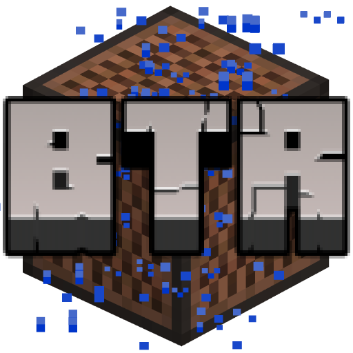

  

# Better than Rain!

An ambiance mod for **Better than Adventure!** (a b1.7.3 fork) that makes subtle adjustments to the rain experience. Currently it adds unique dynamic sounds to different blocks when raining, and soon *slightly* more realistic rain visuals! (just audio for now)

This mod aims to improve the rain atmosphere while keeping the vanilla feel alive, especially for beta versions.

*Inspired by [Cool Rain by Jaiz](https://modrinth.com/mod/coolrain) for later versions*

## Features

### Dynamic Rain Sounds
Experience immersive rain ambiance with unique sounds for different block types:

- **Block of Iron** - Normal and muffled
- **Block of Gold** - Normal and muffled
- **Block of Steel** - Normal and muffled
- **Ice** - Normal and muffled
- **Glass** - Normal and muffled
- **Tinted Glass** - Normal and muffled
- **Reinforced Glass** - Normal and muffled
- **Leaves** - Normal
- **Water** - Normal
- **Lava** - Normal
- **Wood Planks** - Muffled
- **Wool** - Normal and muffled
- **Lamps** - Normal and muffled
- **Paper Wall (Block)** - Normal and muffled
- **Noteblocks** - Normal
- **Cobblestone** - Normal
- **Nether Coal** - Normal
- **Nether Coal Block** - Normal
- **Wet Pumice** - Normal

### Demo video!

## Installation

### Prerequisites
- **BTA!**
- [**Babric**](https://github.com/Turnip-Labs/babric-instance-repo/releases)
- **HalpLibe** (included with Babric)

### Steps
1. Download the latest release from the [Releases](https://github.com/Pasithea0/better-than-rain/releases) page
2. Place the `.jar` file in your `mods` folder
3. Launch the game
4. Configure your preferences in the options menu

## License

This project is licensed under the **MIT License** - see the [LICENSE](LICENSE) file for details.

## Support

- **Issues**: [Report bugs or request features](https://github.com/Pasithea0/better-than-rain/issues)

