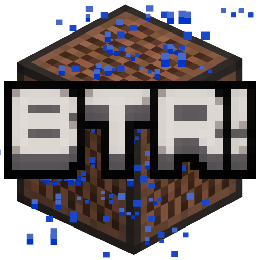

<div align="center">
  
</div>

# Better Than Ambiance!

An ambiance mod for **Better than Adventure!** (a b1.7.3 fork) that makes subtle adjustments to the rain experience and adds other sounds to improve the mood. Currently, it adds unique dynamic sounds to different blocks when raining, improved thunder effects, crickets, and soon more!

*Inspired by [Cool Rain by Jaiz](https://modrinth.com/mod/coolrain) for later versions*

## Features

### Dynamic sounds!
Experience immersive rain ambiance with unique sounds for different block types, crickets, and more!

Rain:
- **Block of Iron** - Normal and muffled
- **Block of Gold** - Normal and muffled
- **Block of Steel** - Normal and muffled
- **Ice** - Normal and muffled
- **Glass** - Normal and muffled
- **Tinted Glass** - Normal and muffled
- **Reinforced Glass** - Normal and muffled
- **Leaves** - Normal
- **Water** - Normal
- **Lava** - Normal
- **Wood Planks** - Muffled
- **Wool** - Normal and muffled
- **Lamps** - Normal and muffled
- **Paper Wall (Block)** - Normal and muffled
- **Noteblocks** - Normal
- **Cobblestone** - Normal
- **Nether Coal** - Normal
- **Nether Coal Block** - Normal
- **Wet Pumice** - Normal

Extra
- **Thunder**
- **Crickets**
- **Restored underwater ambiance**

### Demo video!

[](https://vimeo.com/1102976873?share=copy)

## Installation

### Prerequisites
- **BTA!**
- [**Babric**](https://github.com/Turnip-Labs/babric-instance-repo/releases)
- **HalpLibe** (included with Babric)

### Steps
1. Download the latest release from the [Releases](https://github.com/Pasithea0/better-than-ambiance/releases) page
2. Place the `.jar` file in your `mods` folder
3. Launch the game
4. Configure your preferences in the options menu

## Development

### Prerequisites
- **Java 8** or higher
- **Git**

### Setup
1. Clone the repository:
   ```bash
   git clone https://github.com/Pasithea0/better-than-ambiance.git
   cd better-than-rain
   ```

2. Install dependencies and build the project:
   ```bash
   ./gradlew build
   ```

3. Run the live test (launches Minecraft with the mod):
   ```bash
   ./gradlew runClient
   ```

The development setup will automatically download all required dependencies and launch Minecraft with your mod loaded for testing.

## License

This project is licensed under the **MIT License** - see the [LICENSE](LICENSE) file for details.

## Support

- **Issues**: [Report bugs or request features](https://github.com/Pasithea0/better-than-ambiance/issues)

